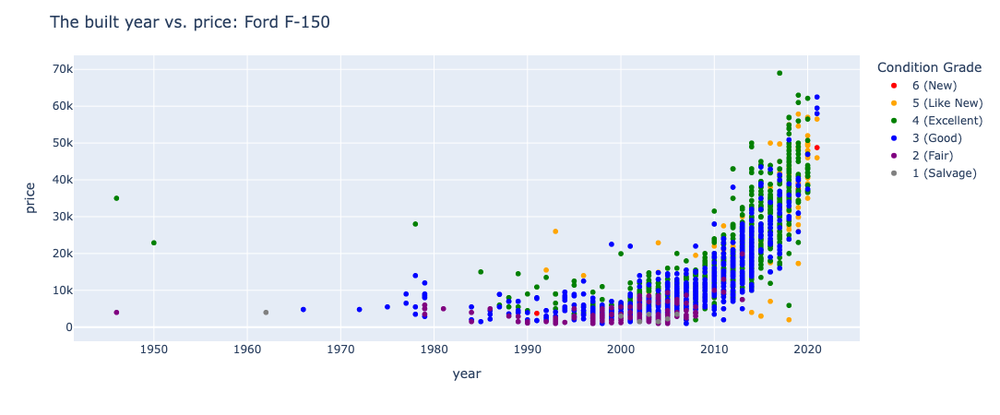
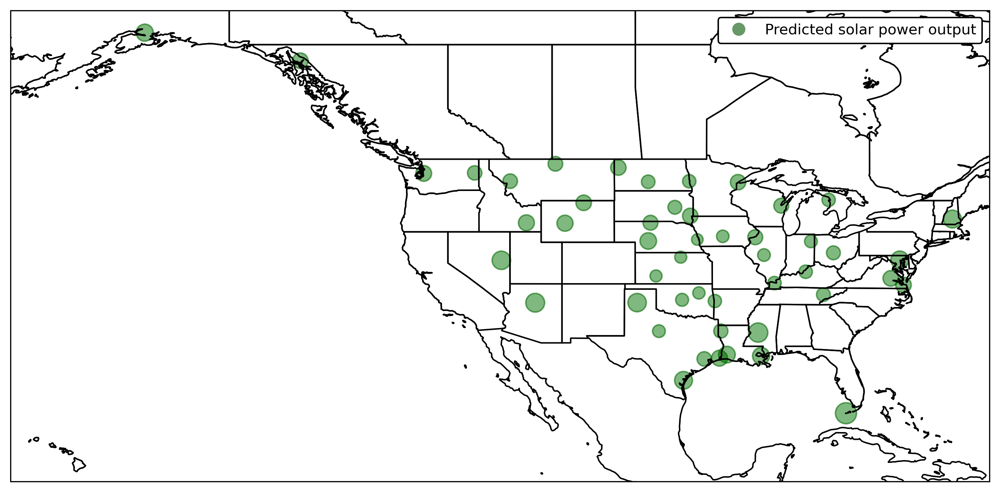

# Nathan Oyama's Workspace for UC Berkeley Machine Learning &amp; Artificial Intelligence (January 2025)

I have created this Git repository for my assignment work of the online bootcamp at University of California, Berkeley, ["the Professional Certificate in Machine Learning and Artificial Intelligence"](https://em-executive.berkeley.edu/professional-certificate-machine-learning-artificial-intelligence) ([Web Archive of January 2025](https://web.archive.org/web/20241119023126/https://em-executive.berkeley.edu/professional-certificate-machine-learning-artificial-intelligence)). I began the course on January 15, 2025 and completed it in early August.

As the name suggests, this course focused on machine learning (ML) and artificial intelligence (AI) designing&ndash;more precisely, the course covered the following topics: 

* major algorithms for numerical prediction, time-seriess analysis, (non-)linear classification, and clustering: logistic regression, ridge regression with L1/L2 regularization, k-nearest neighbors, decision trees, and support vector classification (SVC)
* ensemble techniques: bagging, boosting like AdaBoost, voting regression and gradient-boosted trees
* recommendation systems using the Simon Funk SVD gradient descent algorithm and the SURPRISE library
* natural language processing (NLP) using the natural language toolkit (NLTK) library
* convolutional/deep neural network (DNN) using Keras for TensorFlow
* generative AI using Groq
* mathematical interpretation
* model implementation using pandas, scikit-learn, and SciPy for Python
* data visualization usign matplotlib and Plotly

I'd like to thank Professor Amit Jambhekar, Aravind Reddy, and all other faculty staff for their incredible support during the course. I would also like to thank my _"classmates"_ who helped me facilitate discussion and shared insightful ideas.

## Assignment 5: Will the Customer Accept the Coupon?

FEBRUARY 26, 2025. In this assignment, I analyzed the coupon usage dataset (probably by OnStar) and checked what kind of drivers claim or discard coupons for bars, coffee shops, restaurants, and so on. For example, frequent bar visitors tend to use the bar coupons. Every record corresponds to a driver who took this survey, and there is the column or the field to enter whether this driver is using the coupon. I divided the number of drivers who entered 1 (for "yes") in this field by the total sample population to yield the *"acceptance rate*. I got several sample groups of drivers and calculated the acceptance rate for each group to see the likeliness of using the coupons.

  - Jupyter Notebook: [./module05/module05-nathan-oyama.ipynb](./module05/module05-nathan-oyama.ipynb)
  - Dataset: [./module05/coupons.csv](./module05/coupons.csv)

## Assignment 11: What drives the price of a car?

APRIL 15, 2025. See [./module11/README.md](./module11/README.md) and [./module11/prompt_II.ipynb](./module11/prompt_II.ipynb).

## Assignment 16: Comparing Classifiers

JUNE 4, 2025. See [./module16/README.md](./module16/README.md) and [./module16/prompt_III.ipynb](./module16/prompt_III.ipynb).

## Capstone Project: "The best and worst US cities to build solar power plants"

JULY 30, 2025. See [./module20/README.md](./module20/README.md) and [./module20/eda.ipynb](./module20/eda.ipynb).

---

**Disclaimer:** This Git repository is solely used for this online course. Any contents in this repository do not necessarily reflect my views or positions.

Nathan Oyama. nathan.oyama[&alpha;&tau;]berkeley.edu. linkedin.com/in/nathanoyama.

