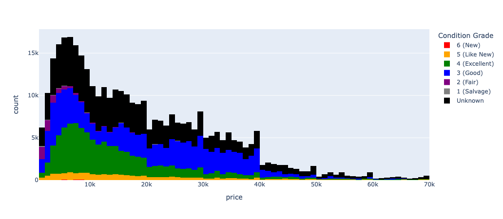

# Module 11: What drives the price of a car?

Nathan Oyama's Workspace for UC Berkeley Machine Learning &amp; Artificial Intelligence 2025

April 15, 2025

* Notebook: [./prompt_II.ipynb](./prompt_II.ipynb)

---

To use this data analysis based on the given data set, your customers need to select models _elsewhere_ because the data set does not include sufficient information to distinguish one model or variant from another. For example, assume that someone is looking for a pickup truck with two rows of seats to sit six passengers such as some kind of Ford F-150. But Ford F-150 used to have a variant for a single-row seat configuration which is not what he is looking for. The data set put all kinds of Ford F-150 into the same model, and there is no "seat count" field. He would also prefer Chevy Silverado over Ford F-150 when it comes to the grill design.

After your cusotmers choose the model(s), you can help them select the right car from the inventory within their budget.

## Goal: Making models to predict the price of a car

**The price models differ across car models.** For example, you cannot use the same price model with VW Beatle and Mercedes-Benz S-Class. In this data analysis, I selected the three most popular car models--Ford F-150 (truck), Toyota Camry (sedan), and Jeep Wrangler (SUV)--to make three pricing models.

Decide the following parameters to predict the price of a car:

**Condition** There are six condition grades: "New", "Like new", "Excellent", "Good", "Fair", and "Salvage". Most cars have either condition grade, but some records do not ("Unknown").

**Odometer mileage** Most cars have the odometer mileage reading between 0 mile and 299,999 miles. I discarded other cars which drove 300,000 miles or even more as instructed in the next section.

**Built year** Most records contain one of the built years ranging betwen 1900 and 2022.

## Cleaning Data

The original data set contains some invalid records such as the most expensive car being priced at $3.7bn, and those few samples with extremely unusual values can affect the data analysis and modeling. In this data analysis, I removed the following cars from the data set:

* Cars with unreasonable model names (e.g. "SPECIAL FINANCE PROGRAM 2021")

* Cars with top 0.1% price tags (> $95,000)

* Cars with odometer mileage of 300,000 miles or greater

The following cars are intentionally kept:

* Cars of unknown conditions

* Cars with no VIN

## Classifying cars into price tiers

Classify the sample cars into three price tiers: cheap cars, typical cars, and expensive cars, as defined in *Table 1*. Cars with the price of $95,000 or even greater are considered "outliers".

*Table 1.*&emsp;The price tier

Price tier     | Minimum price | Maximum price | Percentile |
---------------|---------------|---------------|------------|
Cheap cars     | $0            | $999          | 10.3%      |
Typical cars   | $1,000        | $69,999       | 99.2%      |
Expensive cars | $70,000       | $94,999       | 99.8%      |

*Fig 1.*&emsp;The original data set contained many cheap cars and (very) expensive cars.

## Analyzing Data

After cleaning and classifying the original data set, you can select most popular vehicle model, analyze those samples, and create a model for each vehicle model.

*Fig 2.*&emsp;The price distribution in terms of the odometer mileage and condition grade

*Fig 3.*&emsp;The price distribution in terms of the odometer mileage and condition grade

*Fig 4.*&emsp;The price distribution in terms of the built year and condition grade

*Fig 5.*&emsp;Price vs. odometer mileage and predicted prices based on the hyperbolic regression

*Fig 6.*&emsp;Price vs. built year and predicted prices based on the hyperbolic regression

## Modeling: Ridge regression on the LASSO model

Use the Ridge regression on the LASSO model.

* **Input:** odometer (mileage), built year

* **Output:** price

$$\hat{y} = \sum_{j=1}^{d} \theta_{j} \phi_{j} + \alpha$$

where 

* $\hat{y}$ : the predicted price
* $\theta_{j}$ : the coefficients
* $\phi_{j}$ : The input values
* $d$ : the number of features/parameters
* $\alpha$ : the intercept term

Build such a model with the sample data set of Ford F-150. You can draw a 3-dimensional surface to see how the two featuers, the odometer mileage and built year affect the predcited price.

*Fig 7.* A 3-dimensional surface of $z$ for the predicted price in terms of $x$ for the odometer mileage and $y$ for the built year for Ford F-150

For example, consider that there is the 2015 model of Ford F-150, and its odometer reads 100,000 miles. Input these two feature values and you get the prediction output: $28,132. If the same 2015 model has been driven only 50,000 miles, the predicted price increases to $32,300. And if the built year was as old as 2005, the predicted price decreases to $12,148. These three price tags reflect what you have seen in the charts from the previous section.

*Table 2.*&emsp;Sample Ford F-150 vehicle and preditect price tags

Mileage  | Year | Price (predict)
---------|------|----------------
50,000   | 2015 | $32,300
100,000  | 2015 | $28,132
100,000  | 2005 | $12,148

You can remake such a price prediction model for any other cars as long as you have a considerable number of valid sample records. Again, you cannot combine those models and create a universal one because vehicle models and their price tags often vary a lot. &marker;

---

Nathan Oyama. nathan.oyama[&alpha;&tau;]berkeley.edu.
